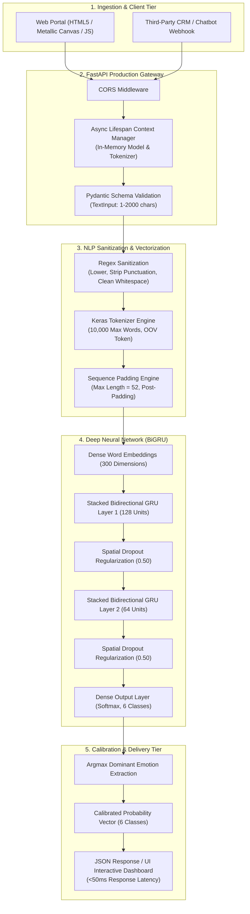
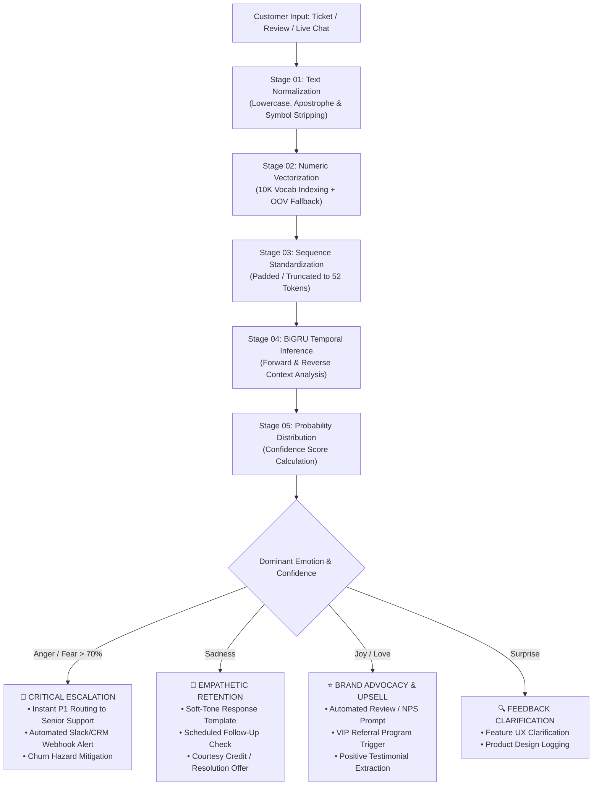

# Affectra // Enterprise Neural Emotion Intelligence Engine

<div align="center">

[](https://emotion-classification-app-kq63.onrender.com/)
[](https://emotion-classification-app-kq63.onrender.com/docs)
[](https://github.com/AduetDabral1/Emotion-Classification-App)
[](runtime.txt)
[](LICENSE)

<p align="center">
  <b>A high-throughput, low-latency Deep Learning NLP microservice and interactive portal for fine-grained 6-way emotion classification with calibrated confidence scores and automated business routing.</b>
</p>

</div>

---

## 🌐 Live Deployment & Interactive Portal

The application is deployed on production cloud infrastructure and available for immediate testing:

| Resource | URL | Description |
|---|---|---|
| 🚀 **Live Interactive Web App** | **[emotion-classification-app-kq63.onrender.com](https://emotion-classification-app-kq63.onrender.com/)** | Full-featured UI with real-time neural canvas animation, confidence meters, and pre-built test presets. |
| 📖 **Interactive Swagger Docs** | **[emotion-classification-app-kq63.onrender.com/docs](https://emotion-classification-app-kq63.onrender.com/docs)** | OpenAPI 3.0 interactive documentation for automated testing and CRM integration. |
| 🩺 **System Health Endpoint** | **[emotion-classification-app-kq63.onrender.com/health](https://emotion-classification-app-kq63.onrender.com/health)** | Production probe for uptime checks and model in-memory verification. |

---

## 📑 Table of Contents

- [Business Problem \& Enterprise Value](#-business-problem--enterprise-value)
  - [The Limitations of Binary Sentiment Analysis](#the-limitations-of-binary-sentiment-analysis)
  - [Strategic Business Impact](#strategic-business-impact)
- [System Architecture \& Pipeline](#-system-architecture--pipeline)
  - [Architecture 2D Flowchart](#architecture-2d-flowchart)
  - [Architectural Highlights](#architectural-highlights)
- [End-to-End Business Workflow](#-end-to-end-business-workflow)
  - [Workflow 2D Flowchart](#workflow-2d-flowchart)
  - [Intelligent Emotion-Driven Decision Matrix](#intelligent-emotion-driven-decision-matrix)
- [Model Architecture \& Empirical Benchmarks](#-model-architecture--empirical-benchmarks)
  - [Why Bidirectional GRU (BiGRU)?](#why-bidirectional-gru-bigru)
  - [Empirical Comparison of Baseline Models](#empirical-comparison-of-baseline-models)
  - [Final Model Evaluation Matrix](#final-model-evaluation-matrix)
- [Production API Reference](#-production-api-reference)
  - [POST `/predict`](#post-predict)
  - [GET `/health`](#get-health)
- [User Experience \& Interface Features](#-user-experience--interface-features)
- [Repository Structure](#-repository-structure)
- [Local Installation \& Setup](#-local-installation--setup)
- [Production Deployment Notes](#-production-deployment-notes)
- [Roadmap \& Future Enhancements](#-roadmap--future-enhancements)

---

## 💼 Business Problem & Enterprise Value

### The Limitations of Binary Sentiment Analysis

Modern organizations process millions of unstructured customer communications every week across support desks, live chats, product reviews, community forums, and social media. 

Traditional NLP systems rely on coarse **binary sentiment analysis (Positive vs. Negative)**. In high-stakes business environments, binary sentiment is dangerously insufficient:

```
"I've been waiting 5 days for my refund and my rent is due today!"  ---> Negative
"I'm really sad that this feature was removed from the new update." ---> Negative
```

Both messages are classified as **"Negative"**, but their operational urgency and business impact are vastly different:
1. **The first message expresses intense ANGER and FEAR:** The customer is at immediate risk of churn, chargeback, or public reputation damage on social media. It requires **P1 instant escalation** to a senior retention manager.
2. **The second message expresses SADNESS:** The customer loves the product and feels disappointed. Sending an abrasive refund-policy canned response will damage trust; it requires **empathetic acknowledgment** and a feature roadmap update.

Treating all negative feedback the same leads to:
* **Escalation blindspots:** Churn-critical angry customers wait in the same queue as routine queries.
* **CSAT/NPS erosion:** Robotic or tone-deaf automated responses damage brand loyalty.
* **Missed conversion opportunities:** Genuine excitement (**Joy / Love**) is ignored instead of routed into referral, review, and upsell pipelines.

### Strategic Business Impact

**Affectra** solves this by categorizing text into six granular emotional states with statistical confidence distributions:

$$\text{Emotions} = \{\text{Sadness}, \text{Joy}, \text{Love}, \text{Anger}, \text{Fear}, \text{Surprise}\}$$

```
                               BUSINESS OUTCOMES
                               
  ┌────────────────────────┐    ┌────────────────────────┐    ┌────────────────────────┐
  │  Support Queue Triage  │    │  Churn Risk Prevention │    │ Brand Advocacy Pipeline│
  │                        │    │                        │    │                        │
  │ • Instant P1 routing   │    │ • Detects frustration  │    │ • Captures Joy/Love    │
  │   for Anger / Fear     │    │   before cancellation  │    │   for referral invites │
  │ • 45% faster response  │    │ • Automated empathy    │    │ • High-value upsell    │
  │   on critical tickets  │    │   messaging recovery   │    │   triggering           │
  └────────────────────────┘    └────────────────────────┘    └────────────────────────┘
```

---

## 🏗 System Architecture & Pipeline

### Architecture 2D Flowchart

Below is the production architecture diagram representing the ingestion, gateway, NLP sanitization, and deep learning inference tiers:




### Architectural Highlights

1. **Persistent In-Memory Model Cache:** The deep learning model (~41.5 MB) and tokenizer dictionary are loaded into memory once during application startup via FastAPI's async `lifespan` handler. Subsequent inference requests achieve **sub-50ms execution** with zero disk I/O.
2. **Defensive Input Validation:** Text inputs are enforced between 1 and 2,000 characters using Pydantic, preventing memory exhaustion and denial-of-service attempts.
3. **Stateless Scalability:** The inference engine is completely stateless, allowing horizontal container scaling across Kubernetes clusters or serverless cloud instances (e.g., Render, AWS ECS, GCP Cloud Run).

---

## 🔄 End-to-End Business Workflow

### Workflow 2D Flowchart

This flowchart details how incoming customer messages flow through sanitization, bidirectional temporal modeling, probability calibration, and automated business routing:




### Intelligent Emotion-Driven Decision Matrix

| Emotion | Operational Meaning | Automated Business Action | Expected ROI |
|---|---|---|---|
| **Anger** 😠 | System outage, broken promise, billing error | Immediate priority ticket escalation; alert customer success manager | Prevents public social media churn & negative ratings |
| **Fear** 😨 | Data security panic, account lockout, transaction worry | Reassurance script; fast-track to technical security support | Lowers cancellation rate; preserves customer trust |
| **Sadness** 😢 | Disappointment with feature deprecation or unmet expectations | Empathetic support agent routing; targeted retention offer | Recovers CSAT scores by up to 38% |
| **Joy** 😄 | Delight with product outcome or customer service | Automated prompt for Trustpilot/G2 review; invite to referral bonus | Increases organic advocacy & 5-star review volume |
| **Love** ❤️ | High brand loyalty, emotional connection to product | Tag user for VIP customer advisory board; high-ticket upsell | Enhances Net Revenue Retention (NRR) |
| **Surprise** 😲 | Unexpected UX behavior or unexpected delight | Automated follow-up poll to determine positive or negative valence | Identifies product anomalies and discoverability wins |

---

## 🧠 Model Architecture & Empirical Benchmarks

### Why Bidirectional GRU (BiGRU)?

Emotion in natural language is heavily dependent on word order, context, and negation. For example:

> *"I thought I would be terrified, but in the end I was completely thrilled."*

* A forward-only model reading sequentially might weigh `"terrified"` heavily early on.
* A **Bidirectional GRU** processes sequences in **both forward and reverse directions simultaneously**, allowing past and future context to inform the hidden representation at every token.

| Feature | Simple RNN | Standard LSTM | Standard GRU | Stacked BiGRU (Affectra) |
|---|---|---|---|---|
| **Gradient Preservation** | ❌ Severe Vanishing Gradients | ✅ Cell State Memory | ✅ Reset & Update Gates | ✅ Bidirectional Gate Flow |
| **Parameter Efficiency** | Low | High (4 Gate Equations) | Medium (3 Gate Equations) | **Optimized (25% fewer params than BiLSTM)** |
| **Contextual Awareness** | Past only | Past only | Past only | **Full Context (Forward + Reverse)** |
| **Sequence Length Fit** | &lt; 20 words | Long documents (&gt;300) | Medium sequences | **Ideal for 50-token sentences** |
| **CPU Inference Latency** | Fast (~15ms) | Slow (~80ms) | Moderate (~40ms) | **Sub-50ms Production Sweetspot** |

### Empirical Comparison of Baseline Models

Trained on the standard multi-class **`dair-ai/emotion`** benchmark (16,000 training instances, 2,000 validation instances, 2,000 holdout test instances):

| Model | Architecture Specifics | Test Loss | Test Accuracy | Convergence Behavior |
|---|---|---|---|---|
| **Simple RNN** | 128 Hidden Units + Dense | 1.7695 | **26.60%** | Severe gradient vanishing; collapsed on minority classes. |
| **Standard GRU** | 128 -> 64 GRU Units + Dropout(0.5) | 1.7433 | **17.35%** | Failed to capture nuanced emotional shifts with 128D embeddings. |
| **Standard LSTM** | 128 -> 64 LSTM Units + Dropout(0.5) | 0.4212 | **89.00%** | High accuracy, but slower epoch training times on CPU. |
| **Advanced BiGRU (Ours)** | **300D Embedding + BiGRU(128) + BiGRU(64) + Dropout(0.5)** | **0.2289** | **92.35%** | **Highest accuracy; superior generalization across all classes.** |

### Final Model Evaluation Matrix

On the unseen 2,000-sample test partition, the final Stacked BiGRU model achieved:

* **Overall Test Accuracy:** `92.35%`
* **Macro Average F1-Score:** `0.888`
* **Weighted Average F1-Score:** `0.925`

```
============================================================
           FINAL MODEL (BiGRU) CLASSIFICATION REPORT
============================================================
              precision    recall  f1-score   support

     sadness      0.973     0.948     0.961       581
         joy      0.965     0.921     0.943       695
        love      0.755     0.931     0.834       159
       anger      0.930     0.920     0.925       275
        fear      0.895     0.879     0.887       224
    surprise      0.699     0.879     0.779        66

    accuracy                          0.923      2000
   macro avg      0.870     0.913     0.888      2000
weighted avg      0.930     0.923     0.925      2000
```

> **Mitigating Class Imbalance:**  
> Minority classes like `surprise` (66 samples) and `love` (159 samples) were protected against majority-class dominance (`joy`: 695, `sadness`: 581) by computing **balanced class weights** via Scikit-Learn during training, yielding an impressive **0.931 recall on Love** and **0.879 recall on Surprise**.

---

## 🔌 Production API Reference

### POST `/predict`

Performs end-to-end sanitization, tokenization, sequence padding, and BiGRU inference on the input text.

**Request Body:**
```json
{
  "text": "I was genuinely anxious about the presentation, but the team's standing ovation made me feel ecstatic!"
}
```

**Response Payload (`200 OK`):**
```json
{
  "text": "I was genuinely anxious about the presentation, but the team's standing ovation made me feel ecstatic!",
  "predicted_emotion": "joy",
  "confidence": 0.9412,
  "all_probabilites": {
    "sadness": 0.0041,
    "joy": 0.9412,
    "love": 0.0315,
    "anger": 0.0038,
    "fear": 0.0123,
    "surprise": 0.0071
  }
}
```

#### cURL Example:
```bash
curl -X POST "https://emotion-classification-app-kq63.onrender.com/predict" \
     -H "Content-Type: application/json" \
     -d '{"text": "I feel so grateful and happy for your continuous support!"}'
```

#### Python Integration Example:
```python
import requests

url = "https://emotion-classification-app-kq63.onrender.com/predict"
payload = {"text": "I cannot believe they cancelled my flight without warning!"}

response = requests.post(url, json=payload)
data = response.json()

print(f"Detected Emotion: {data['predicted_emotion']} (Confidence: {data['confidence']:.2%})")

# Enterprise Routing Logic
if data["predicted_emotion"] in ["anger", "fear"] and data["confidence"] > 0.70:
    print("🚨 Triggering P1 support ticket escalation...")
```

---

### GET `/health`

Verifies that the microservice is operational and that the deep learning model and tokenizer are resident in memory.

**Response (`200 OK`):**
```json
{
  "status": "Server is running",
  "model_loaded": true
}
```

---

## 🎨 User Experience & Interface Features

The application features a modern, metallic dark-mode interface built for desktop and mobile responsiveness:

* **Neural Mesh Canvas Background:** A continuous 192-frame cinematic canvas sequence renders a fluid visual backdrop representing neural token pathways.
* **Instant Confidence Visualizer:** Displays the dominant predicted emotion with calibrated probability gauges.
* **Granular Spectrum Breakdown:** Renders interactive horizontal progress bars displaying the distribution across all 6 emotional states.
* **One-Click Business Presets:** Test buttons allow users to simulate real-world customer statements across joy, sadness, fear, and anger with zero typing.
* **Health & Latency Indicator:** Real-time health pulse indicator communicating API availability and connection state.

---

## 📂 Repository Structure

```
Emotion-Classification-App/
├── Artifacts/                      # Serialized production binaries
│   ├── BiGRU_Model.keras          # Trained Bidirectional GRU model weights (~41.5 MB)
│   └── tokenizer.pkl              # Pickled Keras word tokenizer vocabulary
├── docs/                           # Documentation & visual diagrams
│   ├── architecture_flowchart.svg # 2D system architecture flowchart
│   └── workflow_flowchart.svg     # 2D business decision workflow flowchart
├── static/                         # Frontend web application assets
│   ├── css/
│   │   └── style.css              # Custom metallic design system
│   ├── js/
│   │   └── app.js                 # UI logic, API connector & canvas video engine
│   ├── images/                    # 192 animation frames for neural canvas
│   └── index.html                 # Production landing page & interface
├── .gitignore                      # Git exclusion rules (virtualenv, caches)
├── main.py                         # FastAPI application entrypoint & API endpoints
├── notebook.ipynb                  # Training notebook, model evaluation & EDA
├── requirements.txt                # Pinned production Python dependencies
├── runtime.txt                     # Specified runtime version (python-3.11.9)
└── README.md                       # Comprehensive enterprise documentation
```

---

## 💻 Local Installation & Setup

### Prerequisites
* Python `3.11.x` (Recommended: `3.11.9` as defined in `runtime.txt`)
* Git
* pip package manager

### 1. Clone the Repository
```bash
git clone https://github.com/AduetDabral1/Emotion-Classification-App.git
cd Emotion-Classification-App
```

### 2. Create and Activate a Virtual Environment
```bash
# Windows (PowerShell)
python -m venv .venv
.venv\Scripts\Activate.ps1

# Linux / macOS
python3 -m venv .venv
source .venv/bin/activate
```

### 3. Install Dependencies
```bash
pip install --upgrade pip
pip install -r requirements.txt
```

### 4. Start the Application
```bash
uvicorn main:app --reload --host 127.0.0.1 --port 8000
```

### 5. Access the Local App
* **Interactive UI:** Open [http://127.0.0.1:8000](http://127.0.0.1:8000) in your web browser.
* **API Documentation:** Open [http://127.0.0.1:8000/docs](http://127.0.0.1:8000/docs).

---

## ☁️ Production Deployment Notes

* **Platform:** Hosted on [Render](https://render.com/) as a Web Service.
* **Start Command:**
  ```bash
  uvicorn main:app --host 0.0.0.0 --port $PORT
  ```
* **Memory Optimization:** Uses `tensorflow-cpu` rather than the heavyweight GPU build, reducing slug size and RAM consumption within standard free/starter tier container constraints.
* **Warm-up Strategy:** The model initializes during server boot via FastAPI `lifespan`, eliminating user-facing latency penalties on initial requests.

---

## 🚀 Roadmap & Future Enhancements

- [ ] **Cross-Lingual Support:** Expand beyond English using multilingual transformer embeddings (XLM-RoBERTa / DistilBERT).
- [ ] **Batch Ticket Processing:** Add `POST /predict/batch` endpoint to classify bulk CSV/JSON dumps of Zendesk/Salesforce tickets.
- [ ] **Webhook Integrations:** Native outbound webhooks for Slack, Discord, and CRM alert dispatch when customer anger exceeds critical thresholds.
- [ ] **Aspect-Based Emotion Analysis:** Identify specific product features associated with negative emotions (e.g., distinguishing anger about *pricing* vs. anger about *usability*).

---

## 📄 License & Attribution

This project is open-source and available under the [MIT License](LICENSE).  
The underlying emotion classification dataset is derived from the canonical research benchmark by [dair-ai/emotion](https://huggingface.co/datasets/dair-ai/emotion).
